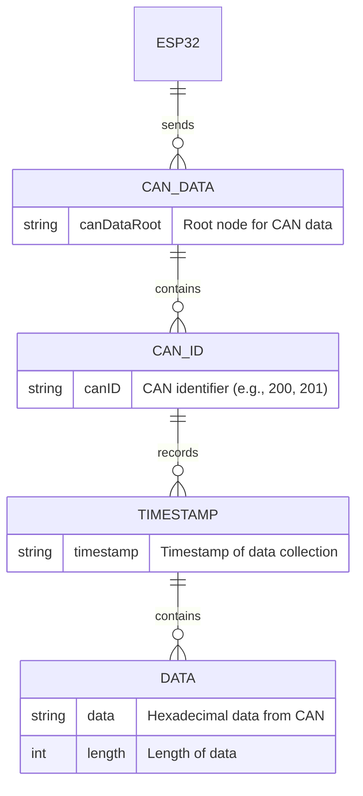

# Cloud Database Design
## Entity Realtional Diagram: 

### Why Firebase?
Firebase provides us with a real-time database which is useful for our functions. This facilitates live data streaming for retrieving data coming in the car in real time.

### Why Firestore?
Firestore allows us to access historical data for future analysis of data recorded by a car. This is also useful for us to have persisting CAN configurations for different users.

