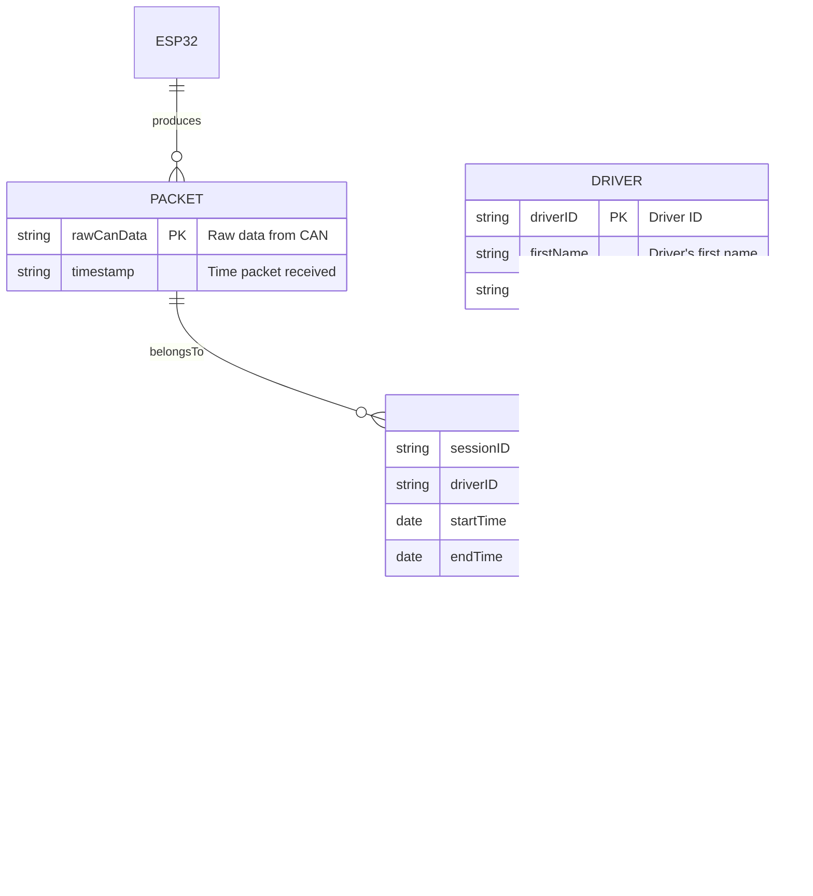

## Entity Realtional Diagram: 

```mermaid
erDiagram
    PACKET ||--o{ SESSION : belongsTo
    SESSION ||--o{ SENSOR_DATA : collects
    DRIVER ||--o{ SESSION : monitors
    PACKET {
        string rawCanData PK "Raw data from CAN"
        string timestamp "Time packet received"
    }
    SESSION {
        string sessionID PK "Unique session identifier"
        string driverID FK "Driver who conducted the session"
        date startTime "Session start time"
        date endTime "Session end time"
    }
    SENSOR_DATA {
        string sensorID PK "Sensor data identifier"
        string sessionID FK "Session associated with sensor data"
        string sensorType "Type of sensor (e.g., RPM, Heat)"
        float value "Recorded value"
        date timestamp "Time value recorded"
    }
    DRIVER {
        string driverID PK "Driver ID"
        string firstName "Driver's first name"
        string lastName "Driver's last name"
    }
    "ESP32" ||--o{ PACKET : produces
    DRIVER ||--o{ SESSION : conducts
    SESSION ||--o{ SENSOR_DATA : has


```
