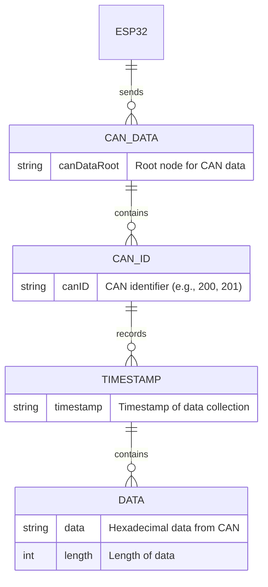

## Entity Realtional Diagram: 

```mermaid
erDiagram
    %%this shows the heiarchy of our Json tree in our FireBase- 
    %%real time database
    CAN_DATA ||--o{ CAN_ID : contains
    CAN_ID ||--o{ TIMESTAMP : records
    TIMESTAMP ||--o{ DATA : contains

    CAN_DATA {
        string canDataRoot "Root node for CAN data"
    }

    CAN_ID {
        string canID "CAN identifier (e.g., 200, 201)"
    }

    TIMESTAMP {
        string timestamp "Timestamp of data collection"
    }

    DATA {
        string data "Hexadecimal data from CAN"
        int length "Length of data"
    }

    ESP32 ||--o{ CAN_DATA : sends
```
