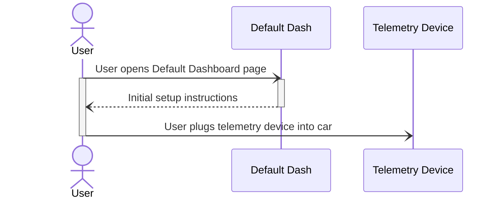
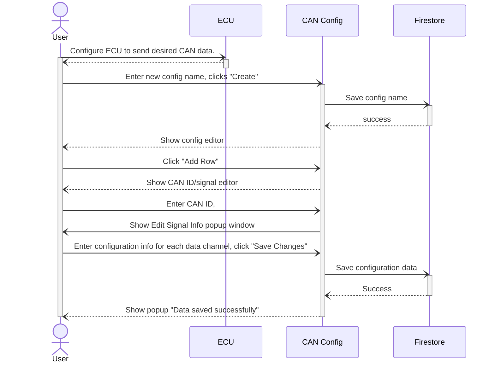
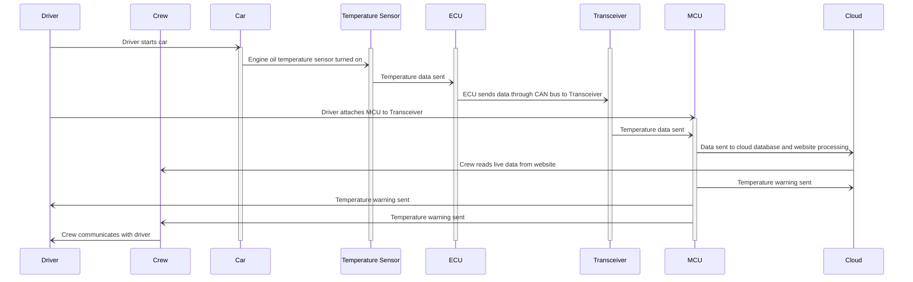
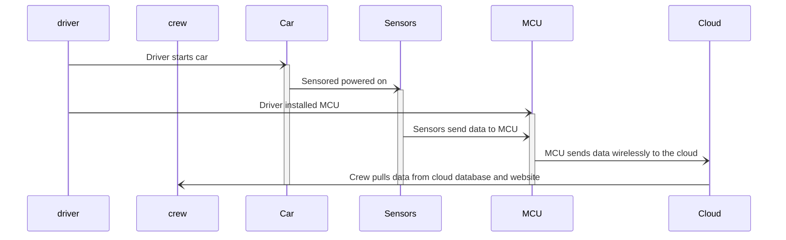
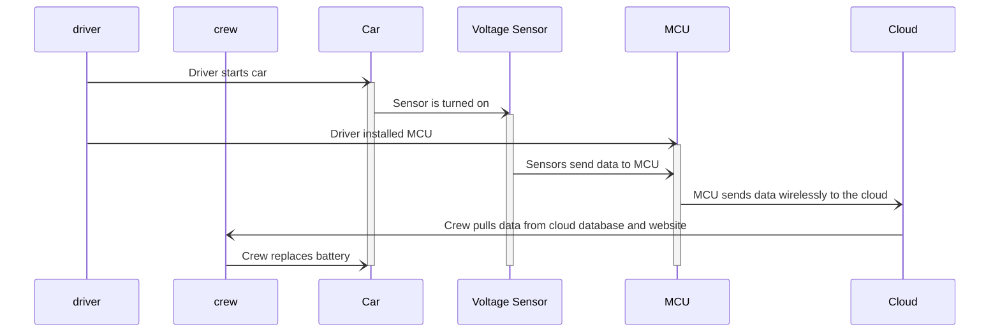
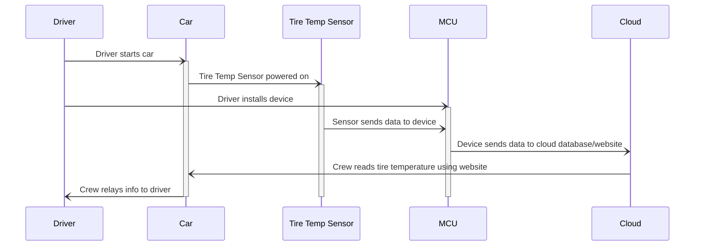
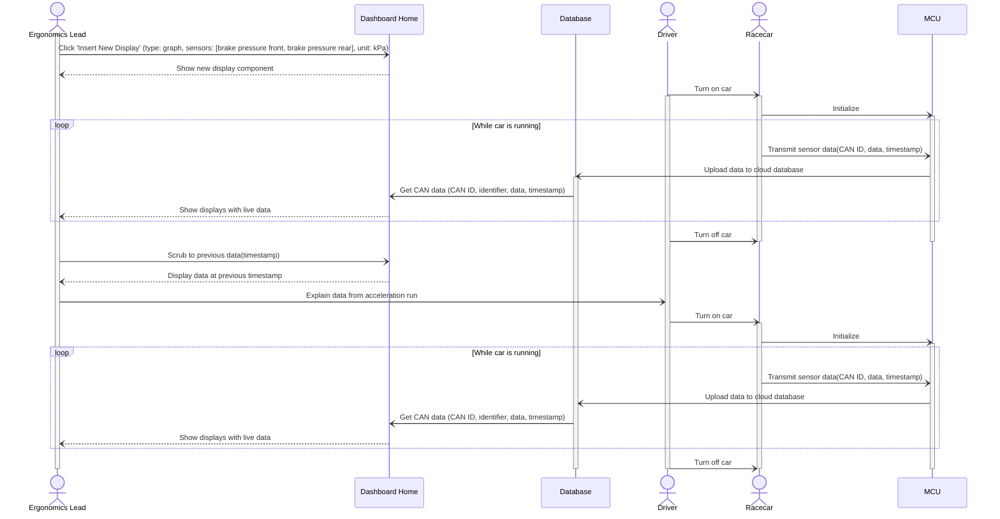
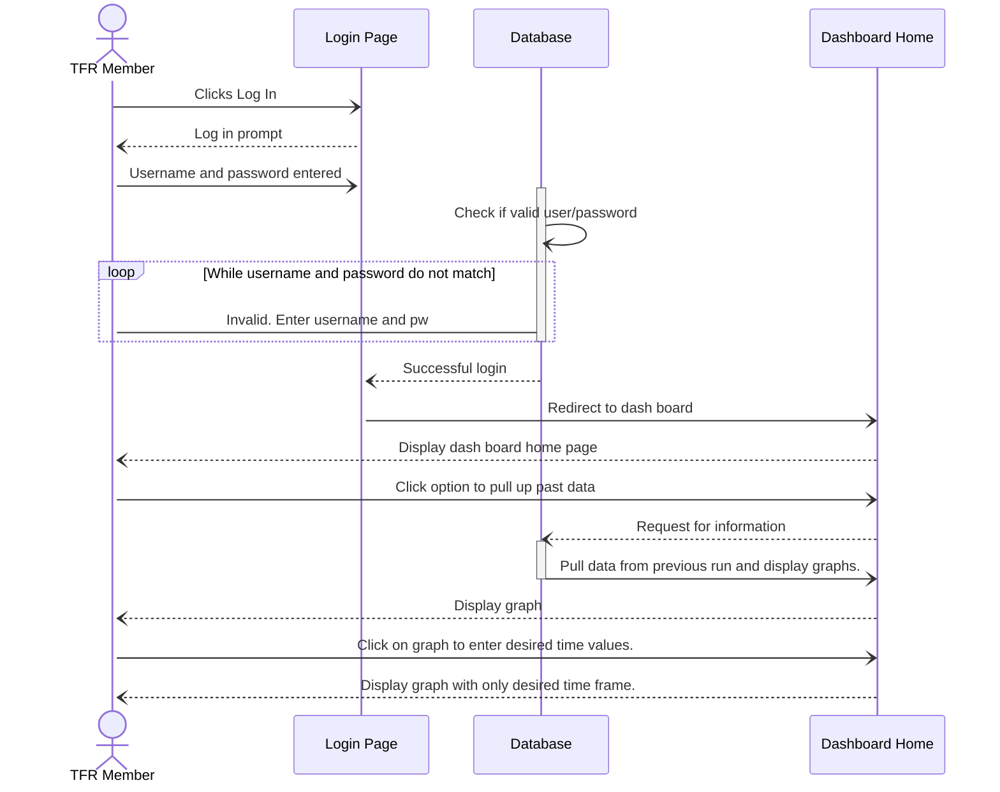

### Use Case 0 - Device Initial Setup
_User follows instructions for initial setup of up telemetry device._
1. User opens the telemetry website to the default dashboard page.
2. A pop-up appears with instructions on how to set up the telemetry device for the first time, including installation of the device in the vehicle.
3. Following the instructions, user plugs the telemetry device into a connector on the car’s wiring harness (the connector contains pins for 5V power, ground, CAN high and CAN low).
4. User closes out of the instructions pop-up.



### Use Case 1
_User edits ECU and webapp CAN configurations to transmit/receive data channels._
1. User configures the vehicle's ECU (engine control unit) to transmit desired data over CAN IDs between 0x200-0x300.
2. User opens the telemetry webapp and opens the CAN Configuration page from the navbar.
3. User is able to choose a previously created configuration or create a new one.
4. When creating new configuration, user can assign CANID and number of signals incoming from ECU.
    - For each data channel, user provides the channel name, start bit, bit length, adder, multiplier, and unit.



Note: All other use cases assume that case 0 and 1 (first time setup) has occurred.

### Use Case 2
_User views live data on default dashboard page._
1. User opens the telemetry webapp, where they see a default dashboard page. It displays "Not Connected", and shows the following default displays (which are visible but empty, as no data is transmitting):
    - "Chips" for each data channel being transmitted across the top of the screen (this persists throughout all pages)
    - A time-series graph of engine coolant temperature
    - A time-series graph of engine speed (RPM)
    - A number for battery voltage
    - A linear gauge for throttle position
2. User selects the current CAN configuration from a menu.
3. A driver turns on the car, beginning data transmission, which causes the display to change to “Connected.” The display components populate with live numbers.

```mermaid
sequenceDiagram
actor User
participant Dash
participant Firestore
participant Realtime
participant ESP32
participant FeatherM4

User -) Dash: Open Default Dashboard page, select CAN Configuration from menu
activate User
activate Dash
User -) Dash: Select a CAN Configuration from menu
Dash -) Firestore: Update Current Configuration
activate Firestore
Firestore -) Dash: Success
deactivate Firestore
Dash --) User: show "Not connected" page with blank displays
User 

deactivate Dash
deactivate User
```

### Use Case 3
_User inserts new display components on custom dashboard page._
1. User opens the telemetry webapp to the default dashboard page (Not Connected).
2. User clicks the "Add Row" button. Insert number of components in row.
3. User chooses "+" sign to assign: Component type, CAN ID, data channel, etc.
4. The new component appears on the dashboard.
5. When the page says “Connected,” the new graphs also populate with live data.

### Use Case 4
_User edits existing components on the dashboard._
1. User clicks the settings button on existing component, bringing up the component editor.
2. User changes the data channel. For example, from battery voltage to fuel pressure, and the type of graph from a number to a linear gauge. 
3. User deletes the throttle position display.

### Use Case 5
_Two users view website at the same time._
1. User 1 opens the telemetry webapp to the default dashboard (Not Connected because the car is off).
2. A driver turns the car on, causing User 1’s page to switch to Connected.
3. User 2 opens the telemetry webapp to the default dashboard, and sees Connected since the car is on.
4. User 2 sees the same display as user 1 - live data as well as historical data from earlier in the run.

<!-- 
OLD SEQUENCE DIAGRAMS
### Use Case 1:
_A race crew is testing their vehicle with their driver to make sure the car is performing well._ 



### Use Case 2:
_A crew recently installed a new part and want to make sure the vehicle is running smoothly._



### Use Case 3:
_A driver has been testing a vehicle. As he is driving, he notices some of the electrical components in the vehicle are flickering, a sign of a problematic battery._



### Use Case 4:
_A driver is getting ready for a race. It is known that tires perform better when hot._



### Use Case 7:
_The new TFR ergonomics lead wants to view information relevant to vehicle handling and driver performance during a run._


### Use Case 8:



### Use Case 9:
_A TFR team member wants to add and delete graphs are being displayed to the dashboard._


-->