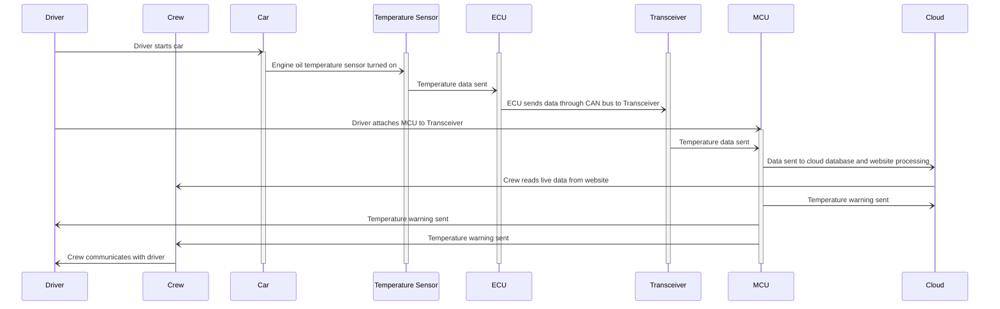
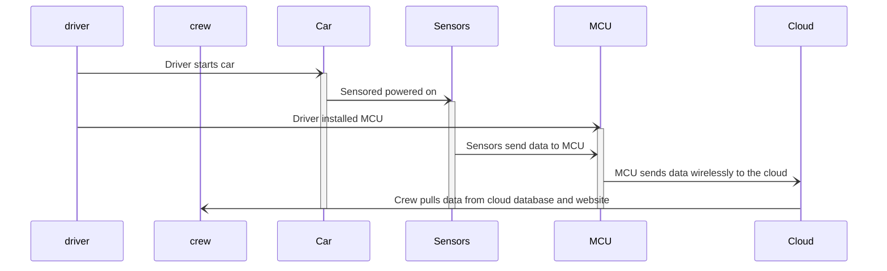
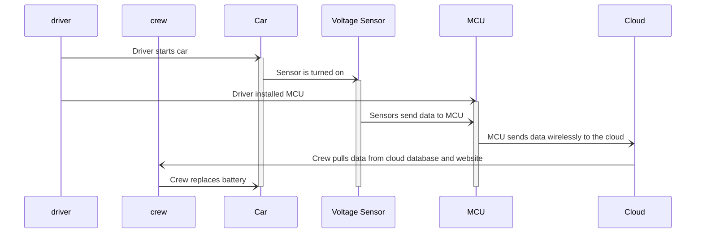
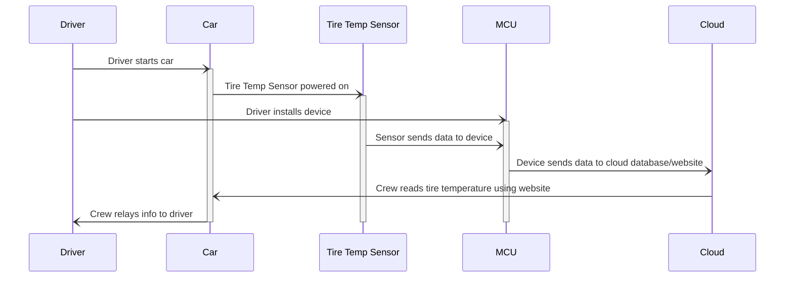
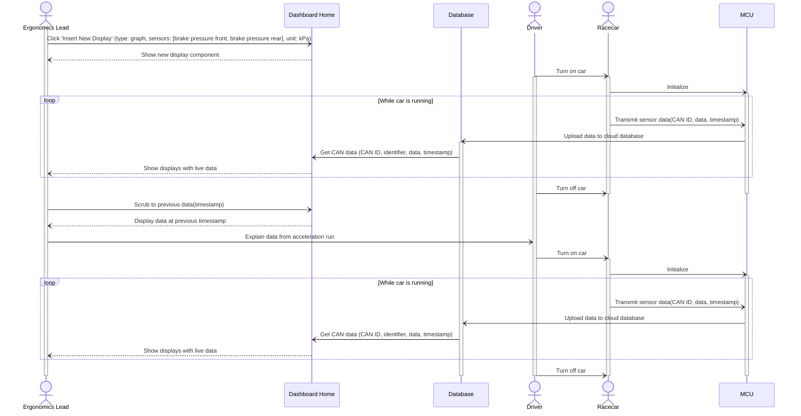
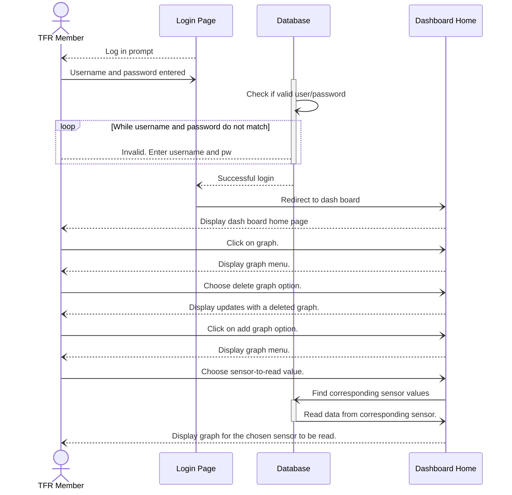

### Use Case 1:
_A race crew is testing their vehicle with their driver to make sure the car is performing well._ 

### Use Case 2:
_A crew recently installed a new part and want to make sure the vehicle is running smoothly._

### Use Case 3:
_A driver has been testing a vehicle. As he is driving, he notices some of the electrical components in the vehicle are flickering, a sign of a problematic battery._

### Use Case 4:
_A driver is getting ready for a race. It is known that tires perform better when hot._

### Use Case 7:
_The new TFR ergonomics lead wants to view information relevant to vehicle handling and driver performance during a run._

### Use Case 8:

### Use Case 9:
_A TFR team member wants to add and delete graphs are being displayed to the dashboard._

