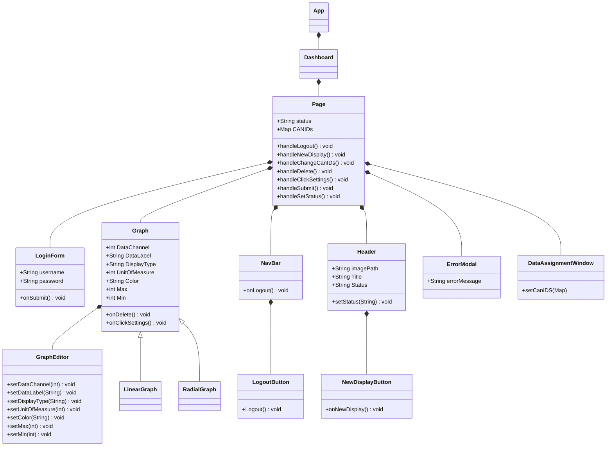
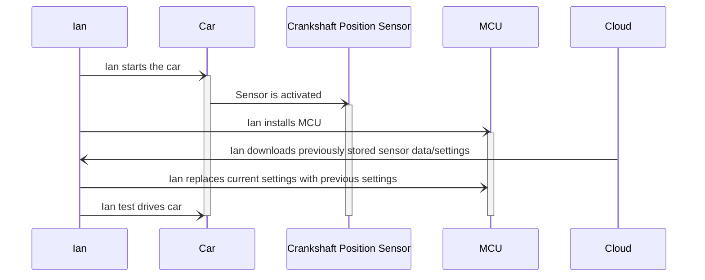
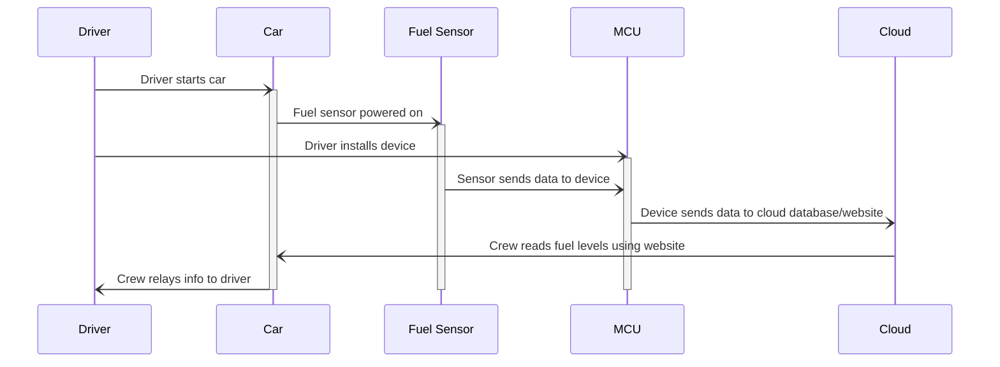

## Front-End Figma Design

Login Page:
 

Dashboard (Connected):

Dashboard (Not Connected):

Component Editor:

Data Assignment Window:

## Front-End UML Class Diagram
This diagram shows the different components which will make up the Dashboard of the web app. The dashboard page is made up of the LoginForm, Graph, LinearGraph, RadialGraph, GraphEditor, NavBar, LogoutButton, Header, NewDisplayButton, ErrorModal, and DataAssignmentWindow components. This is a NextJS app, and this diagram shows the path of /app/dashboard/page.js. All of the Graph related components allow users to customize their dashboard and view data in different ways. The LoginForm component is used to authenticate users sessions. The NavBar and Header components are for structure, design, and allows users to add new displays to their dashboard. The ErrorModal is used when there is a problem with the Live streaming of data, and gives a specific error message to help resolve it. The DataAssignmentWindow is used when the CAN IDs change and need to be mapped to their new data assignment.

<!--
A check list for architecture design is attached here [architecture\_design\_checklist.pdf](https://templeu.instructure.com/courses/106563/files/16928870/download?wrap=1 "architecture_design_checklist.pdf")  and should be used as a guidance.
-->

<!--

### Use Case 4:

### Use Case 5:

-->