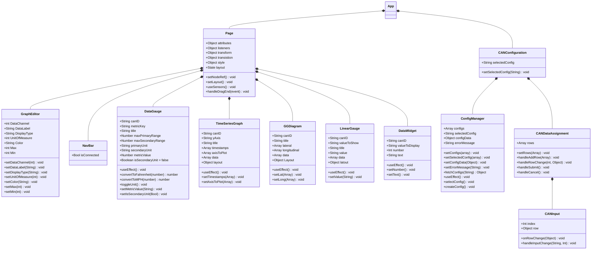
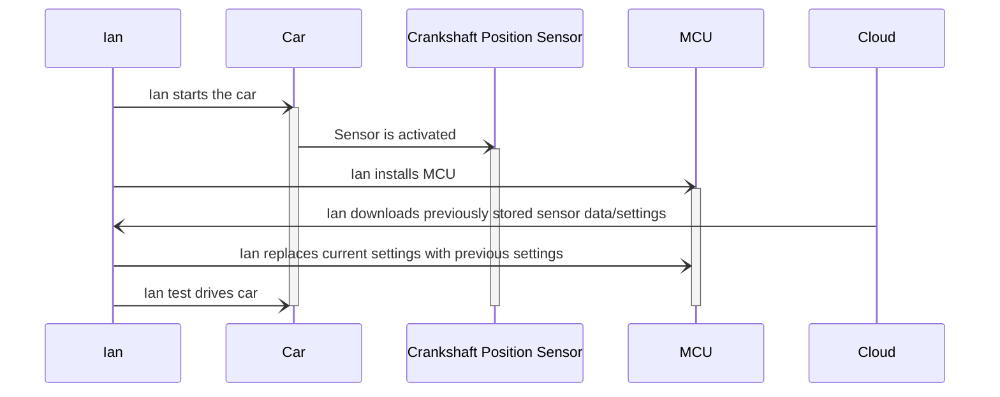
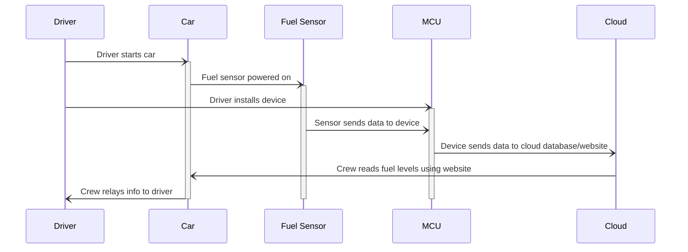

## Front-End Figma Design

Login Page:
 

Dashboard (Connected):

Dashboard (Not Connected):

Component Editor:

Data Assignment Window:

## Front-End UML Class Diagram
This diagram shows the different components which will make up the Dashboard of the web app. The main Page component consists of GraphEditor, NavBar, DataGauge, TimeSeriesGraph, GGDiagram, LinearGauge, and DataWidget, which are all ways that our website displays data. The CANConfiguration page, along with its related components, ConfigManager, CANDataAssignment, and CANInput manage CAN customization.

<!--
A check list for architecture design is attached here [architecture\_design\_checklist.pdf](https://templeu.instructure.com/courses/106563/files/16928870/download?wrap=1 "architecture_design_checklist.pdf")  and should be used as a guidance.
-->

<!--

### Use Case 4:

### Use Case 5:

-->