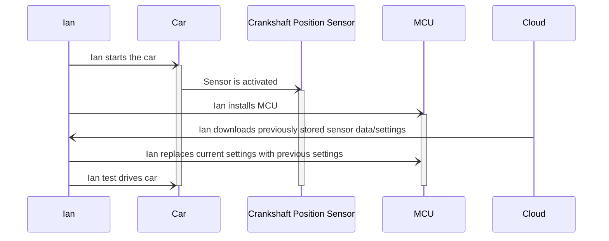
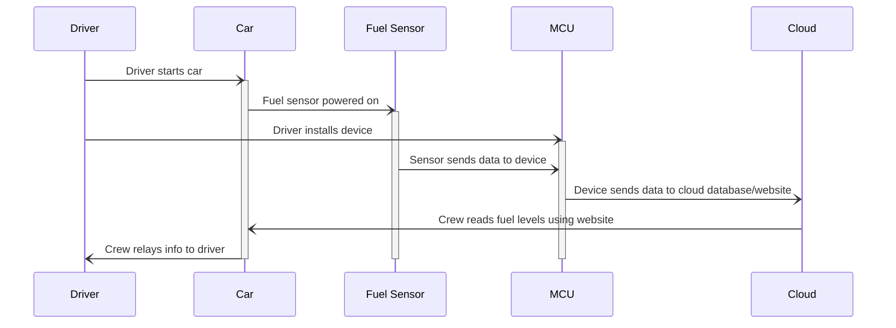

### Dashboard Quick Reference Guide

### Dashboard

### CAN Configuration Quick Reference Guide

### CAN Configuration

### Component Editor

## Front-End UML Class Diagram
This diagram shows the different components which make up the front-end of the web app. The app is seperated into two segments, page (the dashboard) and CANConfiguration. The page component consists of the different types of graphs which are used to show data, the componentEditor which is used to edit and create the graphs, the navbar for navigation, and the instructionModal for the quick start guides. The CANConfiguration component consists of the components used to create, modify, update, and delete CAN Configurations.

```mermaid
classDiagram
App *-- Page
Page *-- NavBar
Page *-- DataGauge
Page *-- TimeSeriesGraph
Page *-- XYGraph
Page *-- LinearGauge
Page *-- DataWidget
Page *-- InstructionsModal
App *-- CANConfiguration
CANConfiguration *-- ConfigManager
CANConfiguration *-- CANDataAssignment
CANConfiguration *-- CANDataView
DataGauge -- ComponentEditor
TimeSeriesGraph -- ComponentEditor
XYGraph -- ComponentEditor
LinearGauge -- ComponentEditor
DataWidget -- ComponentEditor



InstructionsModal: +Boolean open
InstructionsModal: +onClose()
InstructionsModal: +Object children





CANDataAssignment *-- CANInput

DataGauge: +Number uniqueID
DataGauge:+Number metricValue
DataGauge:+String unit
DataGauge:+Object storedConfig
DataGauge:+Object initialConfig
DataGauge:+Object config
DataGauge:+Aray range

DataGauge:+useEffect()void
DataGauge:+fetchAndSetUnit()void
DataGauge:+onValue()void
DataGauge: +Array data
DataGauge: +Array layout
DataGauge: +setUnit(string)void
DataGauge: +setmetricValue(Number)void
DataGauge: +setConfig(Object)void

TimeSeriesGraph: +Number uniqueID
TimeSeriesGraph: +String unit
TimeSeriesGraph: +Array timestamps
TimeSeriesGraph: +Array valsToPlot
TimeSeriesGraph: +Object config
TimeSeriesGraph: +Object initialConfig
TimeSeriesGraph: +Object storedConfig

TimeSeriesGraph: +fetchAndSetUnit()void
TimeSeriesGraph: +useEffect()void
TimeSeriesGraph: +setTimestamps(Array)void
TimeSeriesGraph: +setValsToPlot(Array)void
TimeSeriesGraph: +setUnit(String)void
TimeSeriesGraph: +setConfig(Object)void

TimeSeriesGraph: +Array data
TimeSeriesGraph: +Array layout


LinearGauge: +String uniqueID
LinearGauge: +Object config
LinearGauge: +Object initialConfig
LinearGauge: +Object storedConfig
LinearGauge: +Number value
LinearGauge: +Array range

LinearGauge: +String unit
LinearGauge: +useEffect()void
LinearGauge: +Array data 
LinearGauge: +Object latout
LinearGauge: +setValue(String)void
LinearGauge: +setUnit(String)void
LinearGauge: +setConfig(Object)void
LinearGauge: +setRange(Array)void
LinearGauge: +fetchAndSetUnit()void




DataWidget: +String canID
DataWidget: +String valueToDisplay
DataWidget: +Int number
DataWidget: +String title
DataWidget: +String unit
DataWidget: +Boolean isElapsed
DataWidget: +String dataName
DataWidget: +String color
DataWidget: +String unitShown
DataWidget: +setNumber(Int)void
DataWidget: +setDataName(String)void
DataWidget: +setColor(String)void
DataWidget: +setUnitShown(String)void
DataWidget: +handleSettingsClose()void
DataWidget: +handleSave(object)void



DataWidget: +String text
DataWidget: +useEffect()void


XYGraph: +Number uniqueID
XYGraph: +String xUnit
XYGraph: +String yUnit
XYGraph: +Array lateral
XYGraph: +Array longitudinal
XYGraph: +String lineColor
XYGraph: +String xDataName
XYGraph: +String yDataName
XYGraph: +Array xRange
XYGraph: +Array yRange

XYGraph: +useEffect()void
XYGraph: +Array data
XYGraph: +Object Layout
XYGraph: +setLat(Array)void
XYGraph: +setLong(Array)void
XYGraph: +Object config
XYGraph: +Object initialConfig
XYGraph: +Object storedConfig
XYGraph: +fetchAndSetUnit()void
XYGraph: +setConfig(Object)void
XYGraph: +setXUnit(String)void
XYGraph: +setYUnit(String)void
XYGraph: +setLat(String)void
XYGraph: +setLong(String)void
XYGraph: +setLineColor(String)void
XYGraph: +setXDataName(String)void
XYGraph: +setYDataName(String)void
XYGraph: +setXRange(Array)void
XYGraph: +setYRange(Array)void


NavBar: +Bool isConnected

Page:+Array rows
Page:+Array error
Page:+Array rowHeights
Page:+Boolean editorOpen
Page:+Object currentEdit
Page:+Object groupedDataChannels
Page:+Boolean open
Page:+Array defaultGraphs
Page:+Array defaultRows

Page:+useEffect()void
Page:+handleClose()void
Page:+handleAddRow()void
Page:+adjustRowHeight(Number, Number)void
Page:+handleOpenEditor(Number, Number)void
Page:+handleSaveComponent(Object)void
Page:+handleRemovePlaceholder(Number, Number)void
Page:+handleRemoveRow(Number)void
Page:+renderGraph(Object)ReactNode




ComponentEditor: +Object componentConfigs
ComponentEditor: +String componentType
ComponentEditor: +Object formState
ComponentEditor: +Object errors
ComponentEditor: +String selectedCanID
ComponentEditor: +Array dataChannels
ComponentEditor: +Array xDataChannels
ComponentEditor: +Array yDataChannels

ComponentEditor: +setComponentType(String)void
ComponentEditor: +setFormState(Object)void
ComponentEditor: +setErrors(Object)void
ComponentEditor: +setSelectedCanID(String)void
ComponentEditor: +setDataChannels(Array)void
ComponentEditor: +setxDataChannels(Array)void
ComponentEditor: +setyDataChannels(Array)void
ComponentEditor: +useEffect()void
ComponentEditor: +handleTypeChange(String)void
ComponentEditor: +handleChange(Object)void
ComponentEditor: +handleCanIDChange(String, String)void
ComponentEditor: +handleSubmit()void











CANDataAssignment: +Array rows
CANDataAssignment: +setRows(Array)void
CANDataAssignment: +Boolean loading
CANDataAssignment: +String error
CANDataAssignment: +Object notification

CANDataAssignment: +setLoading(Boolean)void
CANDataAssignment: +setError(String)void
CANDataAssignment: +setNotification(Object)void
CANDataAssignment: +loadExistingData()void
CANDataAssignment: +fetchCANDATA(Object)void
CANDataAssignment: +handleAddRow()void
CANDataAssignment: +handleRowChange(String, Object)void
CANDataAssignment: +handleDeleteRow(String)void
CANDataAssignment: +showNotification(String, String)void
CANDataAssignment: +handleSubmit()void

CANDataView: +configData(String)
CANDataView: +setConfigData(String)void
CANDataView: +modalOpen(Boolean)
CANDataView: +setModalOpen(Boolean)void
CANDataView: +selectedCanId(String)
CANDataView: +setSelectedCanId(String)void
CANDataView: +signals(Array)
CANDataView: +setSignals(Array)void
CANDataView: +useEffect()void
CANDataView: +handleViewClick(String, Array)void












CANDataAssignment: +handleAddRow(Array)void
CANDataAssignment: +handleRowChange(int, Object)void
CANDataAssignment: +handleSubmit()void
CANDataAssignment: +handleCancel()void

CANInput: +Boolean modalOpen
CANInput: +setModalOpen(boolean)void
CANInput: +Array signals
CANInput: +setSignals(array)void
CANInput: +useEffect()void
CANInput: +fetchSignals()void
CANInput: +handleInputChange(String, String)void
CANInput: +handleModalSubmit()void
CANInput: +handleSignalChange(String, String, String)void






CANInput: +Object row
CANInput: +onRowChange(Object)void
CANInput: +handleInputChange(String, Int)void

ConfigManager: +Array configs
ConfigManager: +setConfigs(array)void
ConfigManager: +String selectedConfig
ConfigManager: +setSelectedConfig(array)void
ConfigManager: +Object configData
ConfigManager: +setConfigData(Object)void
ConfigManager: +String errorMessage
ConfigManager: +Object filteredConfigs

ConfigManager: +setErrorMessage(String)void


ConfigManager: +fetchConfigs(String)Object
ConfigManager: +useEffect()void
ConfigManager: +selectConfig(Number)void
ConfigManager: +handleCreateConfig()void
ConfigManager: +handleDeleteConfig(Number)void


CANConfiguration: +String selectedConfig
CANConfiguration: +Boolean isEditing

CANConfiguration: +setSelectedConfig(String)void
CANConfiguration: +setIsEditing(Boolean)void
CANConfiguration: +useEffect()void
CANConfiguration: +handleClose()void




```

<!--
A check list for architecture design is attached here [architecture\_design\_checklist.pdf](https://templeu.instructure.com/courses/106563/files/16928870/download?wrap=1 "architecture_design_checklist.pdf")  and should be used as a guidance.
-->

<!--

### Use Case 4:

### Use Case 5:

-->